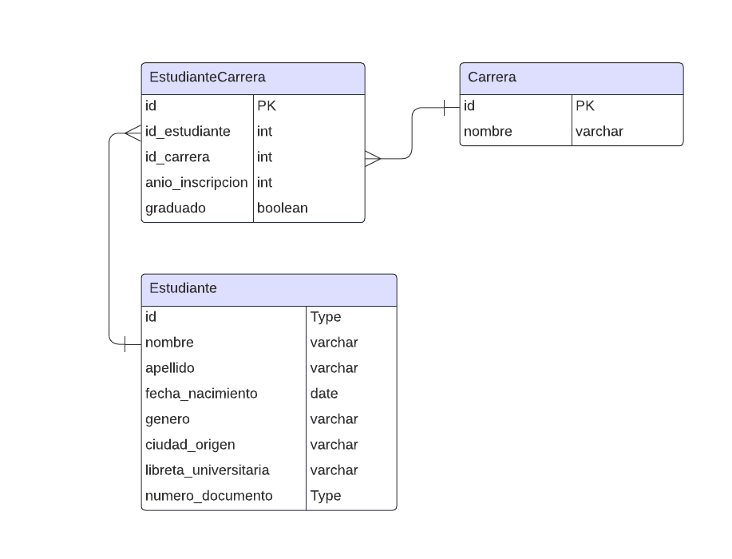
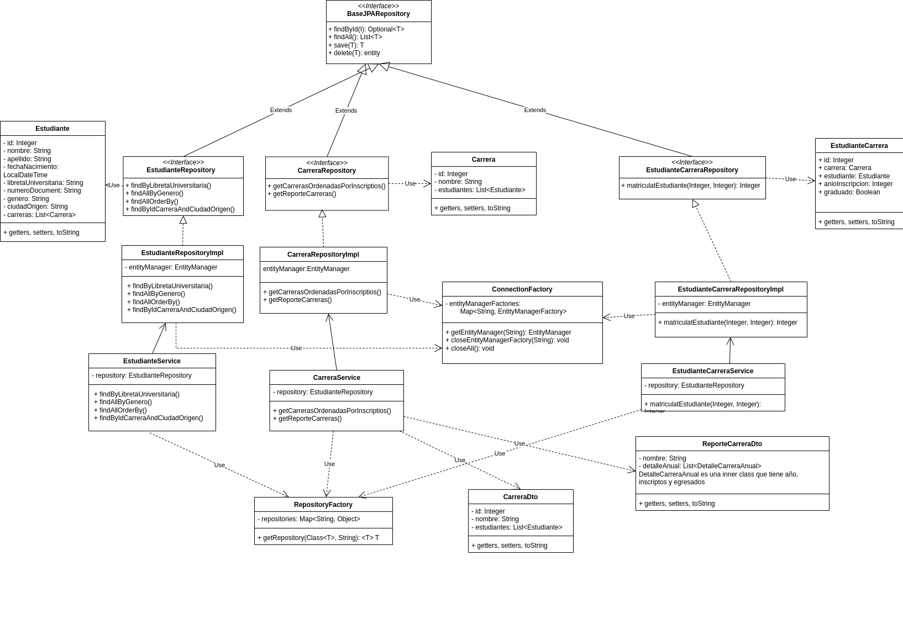

# Trabajo Practico 2, ejercicio 9
    
    a. Diseñar el diagrama de objetos y el diagrama DER correspondiente.
    b. Implementar consultas para:
        1. dar de alta un estudiante
        2. matricular un estudiante en una carrera
        3. recuperar todos los estudiantes, y especificar algún criterio de ordenamiento simple.
        4. recuperar un estudiante, en base a su número de libreta universitaria.
        5. recuperar todos los estudiantes, en base a su género.
        6. recuperar las carreras con estudiantes inscriptos, y ordenar por cantidad de inscriptos.
        7. recuperar los estudiantes de una determinada carrera, filtrado por ciudad de residencia.
    c. Generar un reporte de las carreras, que para cada carrera incluya información de los inscriptos y egresados por año. Se deben ordenar las carreras alfabéticamente, y presentar los años de manera cronológica. Nota: las consultas deben ser resueltas mayormente en JPQL, y no en código Java

Se implementa un sistema de persistencia para representar distintas entidades utilizando Hibernate. 
Permite realizar diversas consultas y transacciones en bases de datos y es adaptable a distintas unidades de persistencia. 
La lógica relacionada a las operaciones CRUD se implementa en los repositories. 
Las instancias de conexiones (entityManager) y repositorios se obtienen de instancias Factory.

# Diagrama de Entidades y Relaciones

# Diagrama de clases

# Puesta en Marcha
## Build
### Buildear el proyecto por línea de comandos desde la carpeta principal del proyecto
    - mvn clean install
## Run application 
### Correr la aplicación por línea de comandos desde la carpeta principal del proyecto:
    - java -jar target/JDBC-1.0-SNAPSHOT.jar